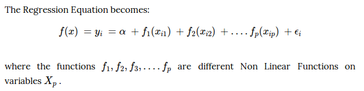
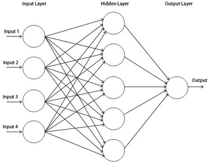

First we need to set up R to have all the functionality that we need

We will install the following packages in order to: 

- Read and write raster data (raster)
- Read and write shapefiles (sf)
- Visualize data (ggplot2)

```{r setup, include=FALSE,eval = FALSE, include = FALSE}
# only run this the first time 
install.packages('rgdal')
install.packages('sf')
install.packages('raster')
install.packages('devtools')
devtools::install_github("tidyverse/ggplot2")
install.packages('lwgeom')
install.packages('caret')
install.packages('gam')
install.packages('tibble')
```

```{r libraries, warning=FALSE, include=FALSE}
rm(list=ls())
# import required libraries
library(sf)
library(raster)
library(ggplot2)
library(caret)
library(gam)
library(tibble)
library(ModelMetrics)
```
  
# Spatial Data Analysis using R

In this tutorial we are going to lear how to use the remote sensing data that we created in Google Earth Engine to train a model to make spatial predictions. 

Objectives:

- Import and visualize raster
- Check rasters have same extent and resolution 
- Import and visualize shp files
- Create a random spatial sample and fit a model
- Make a prediction back to raster layers

## Import and Visualize Raster Inputs
In the following section we are going to use the `raster` function to import our images. We just need to tell the computer where to look. `../` backs us out of the current working directory (which is the `Tutorials` folder) and then looks in the `Example_Data` folder.  

First we will import our population and nighttime lights DNB data. We will read it in, print out a description and then plot them. 

```{r Import and visualize raster Population}
pop = raster('../Example_Data/Belize_median_POP_2010.tif')

print(pop)
plot(pop)
```

```{r Import and visualize raster Nighttime Lights}
dnb = raster('../Example_Data/Belize_median_DNB_2014_2018.tif')

print(dnb)
plot(dnb)
```

One important feature to note here is that the images have the same pixel resolution, same number of rows and columns and the same projection. They both have 637 rows and 366 columns of pixels, each pixel is 0.0044 degrees wide, and they are both projected in WGS 1984 Lat Lon.
 
Since they have the same properties but hold different data it often helps to create a 'stack' out of them. We are essentially creating a two band raster with the first band being nighttime lights DNB and the second being the population data. 

The following code stacks the two images:
```{r Import and visualize raster stack }
dnb_pop_stack = stack(dnb, pop)
print(dnb_pop_stack)
```


```{r Import and visualize shp files}
blz = read_sf('../Example_Data/gadm36_BLZ_0.shp')
#plot(blz)  # simple plot
ggplot()+geom_sf(data=blz)
```

## Sampling Spatial Data

We are going to want to take a random sample of out population and nighttime lights data. In order to do this we need to create a set of random spatial points throughout the country. After that we will extract the pop and dnb data at those location and use them to create a model of the pop = fn(dnb).

```{r Create a random spatial sample and fit a model}
# create 5000 random points
random_points = st_sample(x = blz,size=1000 ,type = 'random')

# visualize points
ggplot()+geom_sf(data=random_points)

# visualize boundary and points  # alpha controls transparency 
ggplot()+geom_sf(data=blz)+geom_sf(data=random_points,alpha=0.1)

```

In this step we extract the raster stack data to those random points. Unfortunately the function ```extract``` can't use a sf based point file, so we will need to create a copy of sp type, and then use that to do the extraction. 

```{r extract raster data to points}
random_points_sp = as(random_points, "Spatial") # extract funciton needs sp spatial object not sf

# Extract raster data to points 
pop_dnb_df = extract(dnb_pop_stack, random_points_sp, df=TRUE) ## df=TRUE i.e. return as a data.frame

# drop any rows where no satellite values were available (missing values are stored as NA)
pop_dnb_df = na.omit(pop_dnb_df)

# print top
print(head(pop_dnb_df))
```

We can now see that each point (point number is stored in ID) has two values Belize_median_DNB_2014_2018 and Belize_median_POP_2010.  We can now use this to create a statistical model to predict population as a function of nighttime lights.

It is often helpful to look at a simple scatter plot of your Y and x values. In this case, it looks like we might have some kind of non-linear response. Let's find out. 

```{r plot xy }
ggplot()+geom_point(data=pop_dnb_df,aes(x=Belize_median_DNB_2014_2018,y=Belize_median_POP_2010))
```

In this tutorial we will be comparing the performance of a few models including:

- Linear regression
- General Additive Models (GAMS) 
- Single layer neural network (nnet)

Before we do this we need to create two indepdent datasets. We will create a 'training' dataset which hold 80% of observations and another 'testing' dataset holding 20% in order to test out-of-sample model performance.

```{r test training split}
set.seed(2)   # this allows us to get the same random sample repeatedly (reproducable results)

# get row numbers of the training dataset
trainIndex = createDataPartition(y = pop_dnb_df$Belize_median_DNB_2014_2018,  # typically put your Y variable here
                                  p = .8, 
                                  list = FALSE, 
                                  times = 1)

pop_dnb_train = pop_dnb_df[ trainIndex,]  # keep training rows
pop_dnb_test  = pop_dnb_df[-trainIndex,]  # omit training rows (keep testing)

# show top example and shape of testing and training
print(head(pop_dnb_train))
print(dim(pop_dnb_train))
print(dim(pop_dnb_test))

```

## Fitting Statistical Models
### Ordinary Least Squares
Now that we have our testing and training data we can start fitting models. Let's start with a simple ordinary least squares regression. 
```{r}

# store the formula defining Y and x 
lm_formula = Belize_median_POP_2010 ~ Belize_median_DNB_2014_2018

lm_fit = lm(lm_formula, data=pop_dnb_train)
summary(lm_fit)

```


### General Additive Models
Since we suspect non-linear relationships between Y and x, we will fit a General Additive Model. GAMs are simply a class of statistical models in which the usual linear relationship between the response (Y) and predictors (x) are replaced by several non linear smooth functions to model and capture the non linearities in the data. These are also a flexible and smooth technique which helps us to fit Linear models which can be either linearly or non linearly dependent on several predictors Xi to capture non linear relationships.


```{r}

formula_gam = Belize_median_POP_2010 ~ s(Belize_median_DNB_2014_2018)  #s() designates which variables to smooth

# fit the gams model
gam_fit = gam(formula_gam, data= pop_dnb_train)

# see results
summary(gam_fit)

```

With GAMS it is often informative to plot out the non-linear responses as estimated. Here we can see that the response increase up to some point and then declines.

```{r plot gams}
# plot non-linear response
plot(gam_fit,se=TRUE)

```


### Neural Net
Next we will fit a very simple neural network. This method basically searches for weights that describe the relationship between x and Y layers. In the hidden layer is where most of the calculations happens, every Perceptron unit takes an input from the input layer, multiplies and add it to initially random weights. It then uses some defined transfer and activation functions to make a final prediction in an output layer. 



```{r nnet CV, message=FALSE, warning=FALSE, include=FALSE}
set.seed(825)

fitControl <- trainControl(## 5-fold CV
                           method = "repeatedcv",
                           number = 5,
                           ## repeated 5 times
                           repeats = 5)

formula_ml = Belize_median_POP_2010 ~ Belize_median_DNB_2014_2018
nnet_fit <- train(formula_ml, 
                 data = pop_dnb_train, 
                 trControl = fitControl,
                 method = "nnet", 
                 verbose = FALSE)
```

```{r print nnet}
nnet_fit
```

### Testing Model Results

Now that we have fitted three models we need to compare their perfomance on the independent testing dataset. Here we will focus on a few different metrics, in this case AIC and R^2 are not available for all models, so we will focus on root mean squared error RMSE instead. 

First we need to make a prediction to the testing dataset for each model. We will then compare these predictions to the actual value and calculate the RMSE for each model.

```{r prediction results}
# store the actual observations of Y
Y = pop_dnb_test$Belize_median_POP_2010

# make predictions to the test dataset
pred_lm = predict(lm_fit, newdata=pop_dnb_test)
pred_gam = predict(gam_fit, newdata=pop_dnb_test)
pred_nnet = predict(nnet_fit, newdata=pop_dnb_test)

# calculate RMSE 
rmse_lm = rmse(Y,pred_lm)
rmse_gam = rmse(Y,pred_gam)
rmse_nnet = rmse(Y,pred_nnet)

tribble(
  ~Model, ~RMSE,
  "ols", rmse_lm,  
  "gams", rmse_gam,
  "nnet",rmse_nnet
)
```

Sometimes simplest is best! Looks like a simple linear regression has the lowest RMSE out-of-sample. This indicates that the relationship between population and nighttime lights is quite simple! 

Let's calculate the percentage of variance explained by the OLS model in the out-of-sample data.

```{r variance exaplained}
rss = sum(rmse_lm)  ## residual sum of squares
tss = sum((Y - mean(Y)) ^ 2)  ## total sum of squares
rsq = 1 - rss/tss
rsq
```
Now let's use our 'best' model to make predictions of population back to the raster stack. 

## Making Spatial Predictions

Luckily making predictions on spatial data (stored in a stack) is as easy as using the predict function. 

```{r Make a prediction back to raster layers}

# make a prediction using OLS back to the raster stack
pred_lm_raster = predict(dnb_pop_stack, model=lm_fit)

plot(pred_lm_raster)

```
 